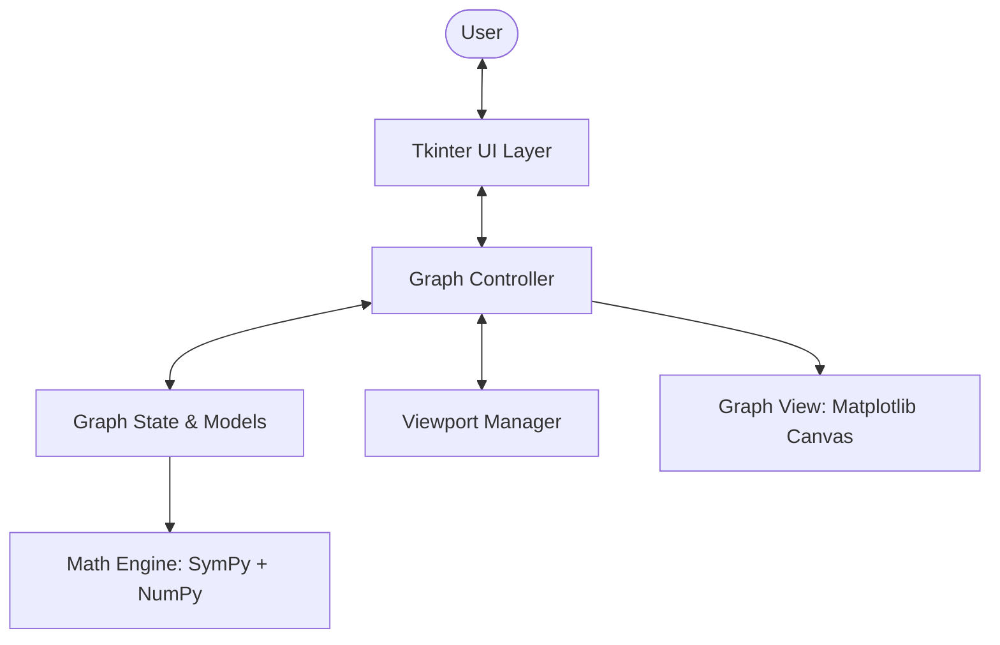

# PyDesmos Architecture Documentation

## 1. High-Level Overview

PyDesmos is designed as a clean, decoupled Model-View-Controller (MVC) style desktop application for graphing Cartesian mathematical functions.

---

## 2. Layer Breakdown

### A. Application Coordinator (`app/application.py`)
- Entry orchestrator initializing the data model (`GraphState`), viewport controller (`Viewport`), coordination logic (`GraphController`), and GUI framework (`MainWindow`).
- Starts the Tkinter event loop.

### B. User Interface Layer (`app/ui/`)
- **`main_window.py`**: Hosts the split pane layout (sidebar + canvas), top toolbar, and bottom coordinate status bar.
- **`expression_panel.py`**: Scrollable sidebar holding a list of active mathematical expressions, add button, and clear all.
- **`expression_row.py`**: Interactive row component displaying a color picker / visibility indicator, text input with live validation, and delete button.
- **`toolbar.py`**: Graph navigation controls (Zoom +, Zoom -, Reset View, Grid toggle, Axes toggle, Quick presets, Help/About dialogs).
- **`dialogs.py`**: User guidance dialogs including mathematical syntax help and about modals.

### C. Graphing Engine (`app/graph/`)
- **`graph_view.py`**: Embeds a Matplotlib `FigureCanvasTkAgg` in Tkinter. Configures axes lines at `x=0, y=0`, dynamic ticks, gridlines, mouse pan dragging, and scroll-wheel zoom centering.
- **`graph_controller.py`**: Mediates between UI actions, Viewport adjustments, and Graph rendering.
- **`viewport.py`**: Maintains coordinate boundaries `[x_min, x_max]` and `[y_min, y_max]`, pans, zooms, and produces linearly spaced sample arrays for vectorized evaluation.

### D. Math Engine (`app/math/`)
- **`parser.py`**: Converts raw user strings into SymPy expressions. Normalizes `^` to `**`, strips `y =` or `f(x) =`, inserts implicit multiplications (`2x` -> `2*x`), and restricts free symbols to `x`.
- **`evaluator.py`**: Lambdifies SymPy expressions into high-performance NumPy vectorized functions. Handles division by zero, non-real numbers (`sqrt(-1)` -> `NaN`), and filters asymptote jumps (e.g. `tan(x)`).
- **`expression.py`**: Immutable wrapper binding parsed SymPy expressions with runtime evaluator and error reporting.

### E. Data Models (`app/models/`)
- **`function_model.py`**: State of a single function (UUID, raw string, color, visibility, validity).
- **`graph_state.py`**: Global state containing all functions, grid/axes toggles, and observer notification hooks.

### F. Utilities (`app/utils/`)
- **`constants.py`**: Visual tokens, default colors, viewport parameters, and font configurations.
- **`validators.py`**: Syntax pre-checkers, balanced parenthesis verification, and input sanitation.

---

## 3. Data Flow: Plotting `y = sin(x) + x^2`

1. User types `y = sin(x) + x^2` into an `ExpressionRow`.
2. `ExpressionRow` passes the string to `FunctionModel.update_expression()`.
3. `ExpressionParser` sanitizes input (`sin(x) + x**2`) and parses it into a SymPy symbolic tree.
4. `ExpressionEvaluator` compiles the SymPy tree to a NumPy function via `sympy.lambdify`.
5. `GraphController` receives notification and calls `GraphView.render()`.
6. `Viewport.get_x_samples()` generates 1,200 points between `x_min` and `x_max`.
7. `FunctionModel.evaluate(x_samples)` computes `y_samples` via NumPy.
8. `GraphView` plots the array to the Matplotlib axis and updates the canvas.
